# E-Learn — Entity Relationship Diagram

The schema separates two branches that used to be tangled in a single `SESSIONS` table:

- **Curriculum (cohort-independent):** `COURSES → CHAPTERS → LESSONS`. A lesson owns its `MATERIALS`, its `RECORDED_SESSIONS` (on-demand video) and its `ASSIGNMENTS`. This content is authored once and seen by every group taking the course.
- **Cohorts (group-specific):** `COURSES → GROUPS → { LIVE_SESSIONS, QUIZZES }`. A live session is one scheduled class — onsite or online — with its own time and room, and it is what `ATTENDANCE` records against. A quiz is a timed, invigilated event issued to one group.

**Assignments and quizzes are different things and live on different branches.** An assignment is homework attached to a lesson: it is checked for on-time submission, and a solution file is released for the student to self-check. It is never scored. A quiz is a timed assessment issued to a group: it opens, it closes, each attempt has its own clock, MCQs auto-score and structured answers go to a human grader.

A recording may optionally point back at the live class it came from (`recorded_from_live_session_id`), but most recorded sessions are pre-recorded content with no live counterpart.

---

## Diagram

```mermaid
erDiagram
    %% ==================== IDENTITY & ACCESS ====================
    USERS {
        uuid id PK
        string email UK
        string password_hash
        string first_name
        string last_name
        int age
        boolean is_active
        timestamp date_joined
        timestamp last_login_at "nullable"
    }

    ROLES {
        uuid role_id PK
        enum name UK "TEACHER, STUDENT, ASSISTANT, PARENT, ADMIN"
    }

    USER_ROLES {
        uuid user_id PK, FK
        uuid role_id PK, FK
    }

    USER_SESSIONS {
        uuid user_session_id PK
        uuid user_id FK
        string refresh_token_hash
        string user_agent
        string ip_address
        boolean is_revoked
        timestamp expires_at
        timestamp created_at
    }

    TEACHERS {
        uuid user_id PK, FK
        string bio
        string specialization
    }

    STUDENTS {
        uuid user_id PK, FK
        string student_code UK
        string school_name
        string grade_level
    }

    PARENTS {
        uuid user_id PK, FK
        string phone "nullable"
    }

    PARENT_STUDENTS {
        uuid parent_user_id PK, FK
        uuid student_id PK, FK
        timestamp linked_at
    }

    INVITES {
        uuid invite_id PK
        uuid issued_by_user_id FK
        string email
        enum role "ASSISTANT, STUDENT, PARENT"
        string token_hash UK
        uuid linked_student_id FK "nullable, PARENT invites only"
        uuid accepted_user_id FK "nullable"
        timestamp expires_at
        timestamp accepted_at "nullable"
        timestamp revoked_at "nullable"
        timestamp created_at
    }

    INVITE_GROUPS {
        uuid invite_id PK, FK
        uuid group_id PK, FK
        boolean can_take_attendance
        boolean can_grade
        boolean can_upload_solutions
    }

    NOTIFICATIONS {
        uuid notification_id PK
        uuid user_id FK
        string title
        string message
        enum type "ASSIGNMENT, QUIZ, ANNOUNCEMENT, SYSTEM"
        boolean is_read
        timestamp created_at
    }

    %% ==================== BILLING ====================
    SUBSCRIPTION_PLANS {
        uuid plan_id PK
        string name
        int max_students
        decimal price
        enum billing_period "MONTHLY, ANNUALLY"
    }

    SUBSCRIPTIONS {
        uuid subscription_id PK
        uuid user_id FK
        uuid plan_id FK
        enum status "ACTIVE, EXPIRED, CANCELLED"
        timestamp start_date
        timestamp end_date
    }

    %% ==================== CURRICULUM (cohort-independent) ====================
    COURSES {
        uuid course_id PK
        uuid teacher_id FK
        string course_code UK
        string subject_name
        string description
        string grade_level
        decimal fees
        enum status "DRAFT, ACTIVE, ARCHIVED"
    }

    CHAPTERS {
        uuid chapter_id PK
        uuid course_id FK
        string title
        string description
        int order_index
    }

    LESSONS {
        uuid lesson_id PK
        uuid chapter_id FK
        string title
        string description
        int order_index
    }

    RECORDED_SESSIONS {
        uuid recorded_session_id PK
        uuid lesson_id FK
        uuid recorded_from_live_session_id FK "nullable, UK"
        string title
        string video_url
        int duration_seconds
        int order_index
        int max_watch_limit
        timestamp publish_at "nullable"
        timestamp deadline "nullable"
        timestamp created_at
    }

    MATERIALS {
        uuid material_id PK
        uuid lesson_id FK
        string title
        string file_url
        timestamp uploaded_at
    }

    ASSIGNMENTS {
        uuid assignment_id PK
        uuid lesson_id FK
        string title
        string description
        string instructions_file_url "nullable"
        int order_index
        timestamp due_date
        string solution_file_url "nullable"
        timestamp solution_released_at "nullable"
        timestamp created_at
    }

    ASSIGNMENT_SUBMISSIONS {
        uuid submission_id PK
        uuid assignment_id FK
        uuid student_id FK
        string file_url
        string student_note "nullable"
        boolean is_late
        timestamp submitted_at
    }

    %% ==================== COHORTS (group-specific) ====================
    GROUPS {
        uuid group_id PK
        uuid course_id FK
        string group_name
        string schedule_info "default recurrence hint"
        string classroom_location "default room"
        int max_capacity
    }

    GROUP_ASSISTANTS {
        uuid assistant_user_id PK, FK
        uuid group_id PK, FK
        boolean can_take_attendance
        boolean can_grade
        boolean can_upload_solutions
        boolean is_revoked
        timestamp assigned_at
    }

    STUDENT_GROUPS {
        uuid student_id PK, FK
        uuid group_id PK, FK
    }

    LIVE_SESSIONS {
        uuid live_session_id PK
        uuid group_id FK
        uuid lesson_id FK "nullable"
        string title
        enum mode "ONSITE, ONLINE"
        string meeting_url "nullable"
        string classroom_location "nullable"
        timestamp scheduled_start
        timestamp scheduled_end
        enum status "SCHEDULED, COMPLETED, CANCELLED"
        timestamp created_at
    }

    ATTENDANCE {
        uuid id PK
        uuid student_id FK
        uuid live_session_id FK
        enum status "PRESENT, ABSENT, LATE"
        timestamp recorded_at
    }

    %% ==================== QUIZZES (cohort branch, timed) ====================
    QUIZZES {
        uuid quiz_id PK
        uuid group_id FK
        uuid lesson_id FK "nullable, tagging only"
        string title
        int max_score
        timestamp opens_at
        timestamp closes_at
        int duration_seconds "nullable, null = untimed"
        timestamp created_at
    }

    QUIZ_QUESTIONS {
        uuid question_id PK
        uuid quiz_id FK
        string question_text
        enum question_type "MCQ, STRUCTURED"
        json options "nullable"
        string model_answer "nullable"
        decimal points
        int order_index
    }

    QUIZ_ATTEMPTS {
        uuid attempt_id PK
        uuid quiz_id FK
        uuid student_id FK
        uuid graded_by_user_id FK "nullable"
        timestamp started_at
        timestamp expires_at
        timestamp submitted_at "nullable"
        decimal auto_score "nullable"
        decimal total_score "nullable"
        string feedback_comments "nullable"
        enum status "IN_PROGRESS, SUBMITTED, GRADED"
        timestamp graded_at "nullable"
    }

    QUIZ_ANSWERS {
        uuid answer_id PK
        uuid attempt_id FK
        uuid question_id FK
        string student_answer "nullable"
        decimal points_awarded "nullable"
        string evaluator_comment "nullable"
        uuid graded_by_user_id FK "nullable"
        timestamp graded_at "nullable"
        uuid claimed_by_user_id FK "nullable"
        timestamp claimed_at "nullable"
    }

    %% ==================== RELATIONSHIPS ====================
    USERS ||--o{ USER_ROLES : "assigned"
    ROLES ||--o{ USER_ROLES : "belongs to"

    USERS ||--o| TEACHERS : "is a"
    USERS ||--o| STUDENTS : "is a"
    USERS ||--o| PARENTS : "is a"

    PARENTS  ||--o{ PARENT_STUDENTS : "monitors"
    STUDENTS ||--o{ PARENT_STUDENTS : "is monitored by"

    USERS    ||--o{ INVITES : "issues"
    USERS    ||--o{ INVITES : "accepts"
    STUDENTS ||--o{ INVITES : "is the subject of (parent invites)"
    INVITES  ||--o{ INVITE_GROUPS : "grants scope in"
    GROUPS   ||--o{ INVITE_GROUPS : "is scoped by"

    USERS ||--o{ USER_SESSIONS : "owns"
    USERS ||--o{ NOTIFICATIONS : "receives"

    USERS ||--o{ SUBSCRIPTIONS : "subscribes via"
    SUBSCRIPTION_PLANS ||--o{ SUBSCRIPTIONS : "defines"

    TEACHERS ||--o{ COURSES : "creates"

    COURSES  ||--o{ CHAPTERS : "is split into"
    CHAPTERS ||--o{ LESSONS : "is split into"
    LESSONS  ||--o{ RECORDED_SESSIONS : "provides video"
    LESSONS  ||--o{ MATERIALS : "provides files"
    LESSONS  ||--o{ ASSIGNMENTS : "sets homework"

    ASSIGNMENTS ||--o{ ASSIGNMENT_SUBMISSIONS : "receives"
    STUDENTS    ||--o{ ASSIGNMENT_SUBMISSIONS : "submits"

    COURSES ||--o{ GROUPS : "is taught to"
    USERS   ||--o{ GROUP_ASSISTANTS : "co-manages (as assistant)"
    GROUPS  ||--o{ GROUP_ASSISTANTS : "assigned assistants"
    STUDENTS ||--o{ STUDENT_GROUPS : "enrolled in"
    GROUPS   ||--o{ STUDENT_GROUPS : "includes"

    GROUPS  ||--o{ LIVE_SESSIONS : "schedules"
    LESSONS ||--o{ LIVE_SESSIONS : "may be covered by"
    LIVE_SESSIONS ||--o| RECORDED_SESSIONS : "may be recorded as"

    LIVE_SESSIONS ||--o{ ATTENDANCE : "tracks"
    STUDENTS      ||--o{ ATTENDANCE : "has"

    GROUPS  ||--o{ QUIZZES : "issues"
    LESSONS ||--o{ QUIZZES : "may be tagged by"

    QUIZZES  ||--o{ QUIZ_QUESTIONS : "contains"
    QUIZZES  ||--o{ QUIZ_ATTEMPTS : "receives"
    STUDENTS ||--o{ QUIZ_ATTEMPTS : "attempts"
    USERS    ||--o{ QUIZ_ATTEMPTS : "grades (as teacher/assistant)"

    QUIZ_ATTEMPTS  ||--o{ QUIZ_ANSWERS : "contains"
    QUIZ_QUESTIONS ||--o{ QUIZ_ANSWERS : "answered by"
    USERS          ||--o{ QUIZ_ANSWERS : "grades (as teacher/assistant)"
```



---

## Constraints

Mermaid cannot express these; they are part of the schema contract.

### Uniqueness

| Table | Constraint | Why |
|---|---|---|
| `CHAPTERS` | `UNIQUE (course_id, order_index)` | Deterministic chapter ordering within a course |
| `LESSONS` | `UNIQUE (chapter_id, order_index)` | Deterministic lesson ordering within a chapter |
| `RECORDED_SESSIONS` | `UNIQUE (lesson_id, order_index)` | Deterministic video ordering within a lesson |
| `RECORDED_SESSIONS` | `UNIQUE (recorded_from_live_session_id)` | Enforces the `||--o|` cardinality: at most one recording per live class |
| `ATTENDANCE` | `UNIQUE (student_id, live_session_id)` | One attendance record per student per class |
| `ASSIGNMENTS` | `UNIQUE (lesson_id, order_index)` | Deterministic homework ordering within a lesson |
| `ASSIGNMENT_SUBMISSIONS` | `UNIQUE (assignment_id, student_id)` | One submission row per student — **re-submission overwrites in place** rather than versioning |
| `QUIZ_QUESTIONS` | `UNIQUE (quiz_id, order_index)` | Deterministic question order for the WF 22 navigator |
| `QUIZ_ATTEMPTS` | `UNIQUE (quiz_id, student_id)` | One attempt per student per quiz — **retakes are not modelled** |
| `QUIZ_ANSWERS` | `UNIQUE (attempt_id, question_id)` | One answer row per question per attempt; autosave upserts against this |
| `INVITES` | `UNIQUE (token_hash)` | The token is the credential; only the hash is stored |
| `INVITES` | `UNIQUE (email, role, issued_by_user_id) WHERE accepted_at IS NULL AND revoked_at IS NULL` | Partial index — one *live* invite per address per role per issuer. Re-inviting the same person is an update, not a second row |
| `INVITE_GROUPS` | composite PK `(invite_id, group_id)` | One scope row per group, mirroring `GROUP_ASSISTANTS` |
| `PARENT_STUDENTS` | composite PK `(parent_user_id, student_id)` | One link row per parent–child pair; re-inviting an existing parent is a no-op, not a duplicate |
| `STUDENT_GROUPS`, `GROUP_ASSISTANTS`, `USER_ROLES` | composite PK | Already covered |

### CHECK constraints

- `LIVE_SESSIONS`: `mode = 'ONLINE'` ⇒ `meeting_url IS NOT NULL`; `mode = 'ONSITE'` ⇒ `classroom_location IS NOT NULL`
- `LIVE_SESSIONS`: `scheduled_end > scheduled_start`
- `RECORDED_SESSIONS`: `max_watch_limit >= 0`, where **`0` means unlimited**
- `SUBSCRIPTIONS`: `end_date > start_date`
- `QUIZZES`: `closes_at > opens_at`
- `QUIZZES`: `duration_seconds > 0` when set; `NULL` means untimed
- `QUIZ_ATTEMPTS`: `expires_at > started_at`
- `INVITES`: `role = 'PARENT'` ⇒ `linked_student_id IS NOT NULL`; `role IN ('ASSISTANT','STUDENT')` ⇒ `linked_student_id IS NULL`
- `INVITES`: `expires_at > created_at`
- `INVITES`: `accepted_at IS NULL OR revoked_at IS NULL` — an invite cannot be both accepted and rescinded
- `ASSIGNMENTS`: `solution_released_at >= due_date` when both set — **releasing the solution before the deadline defeats the assignment**

### Cross-branch integrity

Splitting curriculum from cohorts introduces the possibility of the two branches drifting apart. These cannot be expressed as simple FKs and must be enforced in the service layer on create/update:

1. **`LIVE_SESSIONS.lesson_id`** — when set, the lesson's `chapter.course_id` must equal the `groups.course_id` of the session's group. A group can only cover lessons from its own course.
2. **`RECORDED_SESSIONS.recorded_from_live_session_id`** — when set, and when the source live session has a `lesson_id`, that lesson must match the recording's `lesson_id`.
3. **`QUIZZES.lesson_id`** — when set, must belong to the group's course (same check as 1). Tagging only; it does not move the quiz onto the curriculum branch.

`ASSIGNMENTS` needs no such check: it hangs off `LESSONS` directly and is therefore natively cohort-independent. The corresponding rule moves to authorization — a student may only submit to an assignment whose lesson belongs to a course they are enrolled in through some group.

### Grading invariants

Also service-layer, and all four are what make the WF 15 queue correct:

6. **A grader may only touch answers within their permission.** For a TA: the answer's `attempt → quiz → group` must have a `GROUP_ASSISTANTS` row for that user with `can_grade = true` and `is_revoked = false`. The instructor who owns the course is always permitted.
7. **`points_awarded` may not exceed the question's `points`**, and may not be negative. It is a cross-row check against `QUIZ_QUESTIONS`, so it cannot be a CHECK constraint.
8. **Only `STRUCTURED` answers are human-graded.** `MCQ` answers get `points_awarded` written at submit time with `graded_by_user_id` left null — a null grader on a scored MCQ answer means "machine", not "missing".
9. **An attempt flips to `GRADED` only when every structured answer has a non-null `points_awarded`.** At that moment `total_score` is computed as the sum of all `points_awarded` and `graded_at` is stamped. Until then it stays `SUBMITTED` with `auto_score` populated and `total_score` null.

### Invite invariants

An invite is a *promise* of rows that will exist once it is accepted. Nothing but the service layer can hold it to that promise.

10. **Who may issue what.** An instructor may issue `ASSISTANT`, `STUDENT` and `PARENT` invites against their own courses. A **student may issue only a `PARENT` invite, and only with `linked_student_id` equal to themselves** — WF 05 allows a student to add a parent later from their own settings. No other role issues anything, and `TEACHER` is never an invitable role: instructors self-register.
11. **Scope must belong to the issuer.** Every `group_id` in `INVITE_GROUPS` must resolve to a course owned by the issuing instructor. Otherwise an instructor could grant a TA access to someone else's cohort.
12. **An invite is acceptable only while live** — `accepted_at IS NULL`, `revoked_at IS NULL`, and `expires_at > now()`. Anything else is `410`, never `404`: the recipient followed a real link and deserves to be told it is spent rather than that it never existed.
13. **Acceptance materializes the scope, and the shape depends on the role.** `ASSISTANT` copies each `INVITE_GROUPS` row into `GROUP_ASSISTANTS`, flags included. `STUDENT` writes a `STUDENT_GROUPS` row per scoped group. `PARENT` writes one `PARENT_STUDENTS` row against `linked_student_id`. All of it and the account creation are one transaction.
14. **An invited address may already have an account.** A parent already linked to a child under a different instructor accepts by *attaching* — a new `PARENT_STUDENTS` row on the existing user — not by creating a second account. `accepted_user_id` records which account it resolved to either way. This is what makes one parent account across multiple instructors work.

DB-level alternative for cross-branch rule (1): add a denormalized `course_id` to `LIVE_SESSIONS` and use composite foreign keys against `GROUPS (group_id, course_id)` and a `LESSONS`-side view exposing `(lesson_id, course_id)`. Only worth the cost if the service layer is not the sole writer.

### Parent access scoping

`PARENT_STUDENTS` grants read access; it does not bound it. Two rules must be enforced in the service layer, because no foreign key can express them:

4. **A parent reads nothing outside their linked children.** Every parent-facing query is filtered by `PARENT_STUDENTS (parent_user_id = caller)`. There is no parent-visible endpoint that takes a `student_id` without this check.
5. **A parent is read-only on academic records.** Attendance, grades and schedule are never writable by a `PARENT` role, regardless of link. The only parent write is fee payment.

### Indexes

```
CHAPTERS (course_id)
LESSONS (chapter_id)
RECORDED_SESSIONS (lesson_id)
MATERIALS (lesson_id)
LIVE_SESSIONS (group_id, scheduled_start)   -- the timetable query
LIVE_SESSIONS (lesson_id)                   -- "which groups covered this lesson?"
ATTENDANCE (live_session_id)
ATTENDANCE (student_id)
ASSIGNMENTS (lesson_id)
ASSIGNMENT_SUBMISSIONS (assignment_id, student_id)
ASSIGNMENT_SUBMISSIONS (student_id)         -- "what has this student not handed in?"
QUIZZES (group_id, closes_at)               -- the "due soon" query
QUIZZES (lesson_id)
QUIZ_ATTEMPTS (quiz_id, student_id)
QUIZ_ATTEMPTS (quiz_id, status)
QUIZ_ANSWERS (attempt_id) WHERE points_awarded IS NULL   -- partial: the grading queue itself
QUIZ_ANSWERS (question_id)
GROUP_ASSISTANTS (assistant_user_id) WHERE is_revoked = false  -- "which groups may this TA act on?"
USER_SESSIONS (user_id, is_revoked)
NOTIFICATIONS (user_id, is_read)
INVITES (issued_by_user_id, accepted_at)    -- "my outstanding invites" (WF 13)
INVITES (email)                             -- does this address already have a live invite?
INVITE_GROUPS (group_id)
PARENT_STUDENTS (student_id)                -- "who are this student's parents?" (roster panel, fee reminder
```

### Delete behaviour

| Relationship | Policy | Reason |
|---|---|---|
| `COURSES → CHAPTERS → LESSONS` | `CASCADE` | The curriculum spine falls together |
| `LESSONS → MATERIALS` | `CASCADE` | Files belong to the lesson |
| `LESSONS → RECORDED_SESSIONS` | `CASCADE` | Videos belong to the lesson |
| `LESSONS → LIVE_SESSIONS.lesson_id` | `SET NULL` | **Deleting a lesson must never destroy attendance history** |
| `LIVE_SESSIONS → RECORDED_SESSIONS.recorded_from_live_session_id` | `SET NULL` | The recording outlives the schedule entry |
| `LIVE_SESSIONS → ATTENDANCE` | `CASCADE` | Attendance is meaningless without its class |
| `GROUPS → LIVE_SESSIONS` | `RESTRICT` | Archive groups; don't delete cohorts with history |
| `LESSONS → ASSIGNMENTS` | `CASCADE` | Homework belongs to the lesson — but see the row below, which blocks the cascade once work exists |
| `ASSIGNMENTS → ASSIGNMENT_SUBMISSIONS` | `RESTRICT` | **Student work is never silently destroyed.** An assignment with submissions cannot be deleted, which transitively prevents deleting its lesson |
| `GROUPS → QUIZZES` | `RESTRICT` | Same reasoning as live sessions |
| `LESSONS → QUIZZES.lesson_id` | `SET NULL` | The tag is disposable; the quiz and its attempts are not |
| `QUIZZES → QUIZ_QUESTIONS` | `CASCADE` | Questions have no meaning outside their quiz |
| `QUIZZES → QUIZ_ATTEMPTS` | `RESTRICT` | Student work again |
| `QUIZ_ATTEMPTS → QUIZ_ANSWERS` | `CASCADE` | Answers belong to the attempt |
| `USERS → QUIZ_ANSWERS.graded_by_user_id` | `RESTRICT` | **Grading history outlives the grader.** A TA who graded anything cannot be deleted; revocation is `GROUP_ASSISTANTS.is_revoked`, never a row delete |
| `USERS → GROUP_ASSISTANTS` | `RESTRICT` | Same reason — the assignment row is the audit trail |
| `USERS → USER_SESSIONS` | `CASCADE` | Tokens die with the account |
| `USERS → INVITES.issued_by_user_id` | `CASCADE` | An invite from a deleted account is void. Nothing is lost: acceptance already materialized the real rows, and those survive independently |
| `USERS → INVITES.accepted_user_id` | `SET NULL` | The invite record outlives the account it created |
| `STUDENTS → INVITES.linked_student_id` | `CASCADE` | A parent invite for a deleted student is meaningless |
| `INVITES → INVITE_GROUPS` | `CASCADE` | Scope has no meaning without its invite |
| `GROUPS → INVITE_GROUPS` | `CASCADE` | A pending invite cannot scope a group that no longer exists |
| `USERS → PARENTS` | `CASCADE` | The profile row dies with the account, like `TEACHERS` and `STUDENTS` |
| `PARENTS → PARENT_STUDENTS` | `CASCADE` | Deleting a parent account removes its links; **no student data is touched** |
| `STUDENTS → PARENT_STUDENTS` | `CASCADE` | A deleted student takes its links with it |

---

## Notes on field semantics

- **`GROUPS.schedule_info` and `GROUPS.classroom_location` are defaults, not truth.** They describe the group's usual pattern ("Sun/Tue 4pm, Room B"). The authoritative time and place for any given class live on the `LIVE_SESSIONS` row, which is free to differ for a makeup or relocated session.
- **`LIVE_SESSIONS.lesson_id` is nullable on purpose.** Revision classes, exam prep, and open Q&A sessions are real scheduled classes that map to no single lesson.
- **`RECORDED_SESSIONS.recorded_from_live_session_id` is nullable on purpose.** Most recordings are authored pre-recorded content that never had a live counterpart. When set, it means "this video is the replay of that class".
- **`RECORDED_SESSIONS.publish_at`** gates when students may see the video; **`deadline`** is the last moment they may watch it. Both nullable — null means no gate.
- **`max_watch_limit`** is currently declarative. There is no view-tracking table in this pass, so enforcement lives in the application (or is deferred). Adding a `RECORDED_SESSION_VIEWS` log later is the natural extension.
- **`ASSIGNMENTS.due_date` is a single absolute timestamp on a cohort-independent row.** Every group taking the course shares it. See the open question below — this is the one place the assignment-on-lesson design collides with multi-section teaching.
- **`ASSIGNMENTS.solution_released_at` gates the solution file.** Null means not yet released. The solution is the entire feedback mechanism for homework: there is no score and no grader, so the student self-checks against it.
- **`ASSIGNMENT_SUBMISSIONS` carries no score and no grader.** On-time-ness is the whole record. The three states WF 11 shows are derived, not stored: *Submitted* = a row with `is_late = false`, *Late* = a row with `is_late = true`, *Missing* = no row once `due_date` has passed.
- **`is_late` is a stored boolean, not a status value.** It is computed once at submission time against `due_date` and never changes. Keeping it separate from any status enum is what lets a submission be both late and complete — the old `ASSESSMENT_SUBMISSIONS.status` could not express that.
- **`QUIZZES.opens_at` / `closes_at` are the window; `duration_seconds` is the clock.** A quiz may be open for a week but allow 30 minutes once started. Either may bind first.
- **`QUIZ_ATTEMPTS.expires_at` is materialized, not derived at read time.** It is set on start to `min(started_at + duration_seconds, quiz.closes_at)` so the countdown, the auto-submit and any late-answer rejection all read one authoritative value.
- **`QUIZ_ATTEMPTS.auto_score` and `total_score` are deliberately separate.** `auto_score` is the MCQ subtotal, written at submit time and shown to the student immediately. `total_score` stays null until every structured answer has been graded. This is what makes "MCQ score shows immediately; overall grade stays pending" representable.
- **`INVITES.token_hash`, never the token.** The raw token exists only inside the emailed link. This is the same treatment as `USER_SESSIONS.refresh_token_hash`: a database leak must not hand the reader a set of working invitations.
- **`INVITE_GROUPS` deliberately mirrors `GROUP_ASSISTANTS` column for column.** The invite's scope is a promise of the rows acceptance will write, so acceptance is a straight copy rather than a translation. It also means the scope is queryable and foreign-keyed — a JSON blob would happily reference a group that has since been archived, and the invite page could not render "Section A and Section B" without parsing it.
- **The three permission flags are meaningful only when `role = 'ASSISTANT'`.** A `STUDENT` invite uses `INVITE_GROUPS` purely to say which sections to enroll into, and the flags stay false. They are not read on acceptance for any other role.
- **`issued_by_user_id` points at `USERS`, not `TEACHERS`, on purpose.** Instructors issue most invites, but a student may issue a parent invite for themselves (WF 05). It is also what WF 04 renders: "Mr. Ahmed invited you as a Teaching Assistant" is a join from the invite to the issuing user.
- **`accepted_user_id` is not redundant with `email`.** An address may already have an account — a parent linked to a child under another instructor — in which case acceptance attaches to that account rather than creating one. The field records which account the invite actually resolved to.
- **`revoked_at` is a timestamp where `GROUP_ASSISTANTS.is_revoked` is a boolean, and that asymmetry is intentional.** An invite is a one-shot event whose lifecycle is a sequence of instants (created, expires, accepted or revoked). An assistant assignment is long-lived state that flips. Reading `accepted_at` beside `revoked_at` tells you the whole story of an invite in two columns.
- **`GROUP_ASSISTANTS` carries both axes WF 13 shows.** *Scope* is which rows exist — one per group the TA may act on; "All sections" is N rows, not a wildcard. *Permissions* are the three booleans, matching the three checkboxes at invite time exactly: attendance, grading, homework-solution upload.
- **`GROUP_ASSISTANTS.is_revoked` is why revocation is not a delete.** WF 13 requires removing a TA's access "without deleting grading history", and `QUIZ_ANSWERS.graded_by_user_id` points at that user. Flipping the flag ends access while every graded answer keeps its attribution.
- **`QUIZ_ANSWERS.graded_by_user_id` is per answer, not per attempt.** `QUIZ_ATTEMPTS.graded_by_user_id` records who finalized the attempt; the per-answer field records who scored each individual item. They differ whenever two TAs split one student's paper, which a shared queue makes routine.
- **A null `graded_by_user_id` on a scored answer means the machine graded it.** MCQs are auto-scored at submit with no grader. Only `STRUCTURED` answers ever carry a human id.
- **`claimed_by_user_id` / `claimed_at` are a soft lease, not a lock.** They exist so two TAs working the same queue are not served the same essay. A claim is advisory and expires — the recommended TTL is a few minutes — and nothing prevents grading an unclaimed or expired-claim answer. Drop both fields if only one person ever grades.
- **The queue itself is a query, not a table.** Pending work is `QUIZ_ANSWERS` where `points_awarded IS NULL`, joined to `QUIZ_QUESTIONS` on `question_type = 'STRUCTURED'` and to `GROUP_ASSISTANTS` for scope. The partial index exists to make exactly this cheap.
- **`QUIZ_ATTEMPTS.status = IN_PROGRESS` is the in-flight attempt.** It is what the WF 22 question navigator reads and writes against before final submit.
- **`PARENT_STUDENTS` is many-to-many in both directions, deliberately.** One parent may follow several children (the switcher on Parent Home), and one child may be followed by several parents — mother and father with separate accounts. Neither side is capped.
- **The link is not scoped to an instructor.** A parent with children under two different instructors holds one account and one set of link rows; the instructor boundary is applied at query time by the course each child is enrolled in, not by the link itself.
- **`PARENT_STUDENTS.linked_at`** records when the link was established. The link is auto-approved on invite acceptance — there is no pending or rejected state, so no status column.
- **`PARENTS.phone` is the parent's own contact number**, replacing the old `STUDENTS.parent_phone`. It belongs to the parent's profile, not to the child's.
- **`USER_SESSIONS.user_session_id`** was renamed from `session_id` to remove the name clash with the old content `SESSIONS` table. `USER_SESSIONS` is a refresh-token record and has nothing to do with classes.

## Removed

`SESSIONS` is gone. It previously carried both `video_url`/`max_watch_limit` (on-demand semantics) and was the target of `ATTENDANCE` (physical-class semantics), while hanging off `COURSES` even though attendance is inherently per-cohort. Its responsibilities are now split:

| Old `SESSIONS` field | New home |
|---|---|
| `course_id` | `LESSONS → CHAPTERS → COURSES` (derived) |
| `title` | `LESSONS.title`, plus per-occurrence `LIVE_SESSIONS.title` |
| `video_url` | `RECORDED_SESSIONS.video_url` |
| `order_index` | `LESSONS.order_index` / `RECORDED_SESSIONS.order_index` |
| `max_watch_limit` | `RECORDED_SESSIONS.max_watch_limit` |
| `deadline` | `RECORDED_SESSIONS.deadline` |
| *(referenced by `MATERIALS`)* | `MATERIALS.lesson_id` |
| *(referenced by `ATTENDANCE`)* | `ATTENDANCE.live_session_id` |

`ASSESSMENTS`, `ASSESSMENT_QUESTIONS`, `ASSESSMENT_SUBMISSIONS` and `ASSESSMENT_SUBMISSION_ANSWERS` are gone. One entity was carrying two unrelated things behind a `type` enum: timed, group-issued, human-graded quizzes and lesson-attached, self-checked homework. They share almost no fields — the quiz needs a clock and a grader, the assignment needs a deadline and a solution file — and the wireframes already treated them as separate features (`WF 08` has separate Quiz Builder and Homework tabs; `WF 19` lists them as separate nav items).

| Old field | New home |
|---|---|
| `ASSESSMENTS.type = QUIZ` | `QUIZZES` |
| `ASSESSMENTS.type = ASSIGNMENT` | `ASSIGNMENTS` |
| `ASSESSMENTS.group_id` | `QUIZZES.group_id`; assignments reach a group through `LESSONS → CHAPTERS → COURSES → GROUPS` |
| `ASSESSMENTS.lesson_id` | `ASSIGNMENTS.lesson_id` (mandatory, structural); `QUIZZES.lesson_id` (nullable, tagging) |
| `ASSESSMENTS.due_date` | `ASSIGNMENTS.due_date`; `QUIZZES.closes_at` |
| `ASSESSMENTS.max_score` | `QUIZZES.max_score`; assignments are not scored |
| `ASSESSMENT_QUESTIONS.*` | `QUIZ_QUESTIONS.*` — `question_type` collapsed from `MCQ, ESSAY, TEXT, FILE_UPLOAD` to `MCQ, STRUCTURED`, the only two the builder ever offered |
| `ASSESSMENT_SUBMISSIONS.status = LATE` | `ASSIGNMENT_SUBMISSIONS.is_late` boolean |
| `ASSESSMENT_SUBMISSIONS.status = REJECTED` | Dropped — nothing in any flow rejected a submission |
| `ASSESSMENT_SUBMISSIONS.total_score` | `QUIZ_ATTEMPTS.total_score`, joined by `auto_score` |
| `ASSESSMENT_SUBMISSIONS.submitted_at` | `ASSIGNMENT_SUBMISSIONS.submitted_at`; `QUIZ_ATTEMPTS.submitted_at`, joined by `started_at` and `expires_at` |
| `ASSESSMENT_SUBMISSION_ANSWERS.file_url` | Dropped — file answers were the homework case, now `ASSIGNMENT_SUBMISSIONS.file_url` |
| *(no equivalent)* | `ASSIGNMENT_SUBMISSIONS.student_note`, `ASSIGNMENTS.solution_file_url` |

---

`STUDENTS.parent_phone` is gone. It was a free-text contact string standing in for a relationship the platform could not represent: a parent had no account, no login, and no way to be linked to more than one child. It is replaced by `PARENTS` + `PARENT_STUDENTS`.

| Old field | New home |
|---|---|
| `STUDENTS.parent_phone` | `PARENTS.phone`, reached through `PARENT_STUDENTS` |

---

## Open questions raised by the assignment / quiz split

These are consequences of the split, not objections to it. Each needs a decision before the affected endpoints can be specified.

### 1. A lesson-linked assignment has one deadline, but a course has many sections

`ASSIGNMENTS.due_date` sits on the curriculum branch, so it is shared by every group taking the course. But sections move at different speeds — Section A may reach Lesson 1.2 in week 2 and Section B in week 4. A single absolute deadline cannot serve both, and "checked that they are submitted on time" is the entire point of an assignment.

Three ways out:

| Option | Shape | Cost |
|---|---|---|
| Shared deadline | Keep `due_date` as is | Free, but wrong the moment two sections are out of step |
| Per-group deadline | `GROUP_ASSIGNMENTS (group_id, assignment_id, due_date)` | One junction; assignment stays authored once, deadline becomes cohort-specific |
| Derived deadline | Offset from the `LIVE_SESSIONS` row that covered the lesson for that group | No new table, but depends on a session existing and on `lesson_id` being set |

The ERD as written takes the first option. **If sections are ever out of step, the second is the only correct one.**

### 2. WF 19 shows a grade on homework

The student dashboard renders "Recent grade — Homework 1.1 — 8/10". Assignments are no longer scored, so this number has nothing behind it. Either the wireframe drops it and shows a submitted/late chip instead, or `ASSIGNMENT_SUBMISSIONS` regains an optional score — which reopens the grading queue for homework and undoes part of the split.

### 3. Nothing locks an assignment re-submission

WF 23 says re-submission is allowed "until the instructor grades it; grading locks the submission". There is no grading step for assignments any more, so the lock has no trigger. The natural replacements are `due_date` (no submissions after the deadline) or `solution_released_at` (no submissions once the answers are public). The second is the safer rule and pairs with the CHECK constraint above.

### 4. Late submitters and the released solution

If the solution is released at the deadline and late submissions are still accepted, a late student submits with the answers in hand. Whether late submission stays open after solution release is a policy decision the schema currently does not take.

### 5. Regrades leave no history

`QUIZ_ANSWERS.graded_by_user_id` and `graded_at` record only the *most recent* grader. If an instructor overrides a TA's score — `GAP D9` asks whether they may — the TA's original score is gone. Whether that matters is a policy question: a `QUIZ_ANSWER_GRADE_HISTORY` append-only log is the fix if regrades ever need to be auditable, and is not worth building otherwise.

### 6. Invite questions the wireframes do not answer

Four decisions the schema deliberately leaves open, because no screen implies an answer:

**Does acceptance require the email to match?** The token alone is sufficient to accept, which is standard and means an invite forwarded to a colleague still works. If invites must be non-transferable, acceptance has to compare the authenticated or supplied address against `INVITES.email` — the column is there either way.

**How long is the window?** `expires_at` is stored per invite rather than derived from a global constant, so different roles could expire differently. Nothing currently sets it. WF 03 mentions an expiry window for password resets and offers a resend; invites have no resend flow at all.

**Who may rescind a student-issued parent invite?** A student issues it, but the instructor owns the classroom. Whether the instructor can revoke it, and whether the student can revoke one the instructor issued, is undefined. `revoked_at` records that it happened, not who did it — add `revoked_by_user_id` if that distinction matters.

**What happens to scope that changes before acceptance?** An invite scoped to Section A sits unaccepted while the instructor archives Section A. `GROUPS → INVITE_GROUPS` is `CASCADE`, so the scope row vanishes and the invite silently narrows — possibly to nothing. Whether that should instead invalidate the invite is a policy question.
