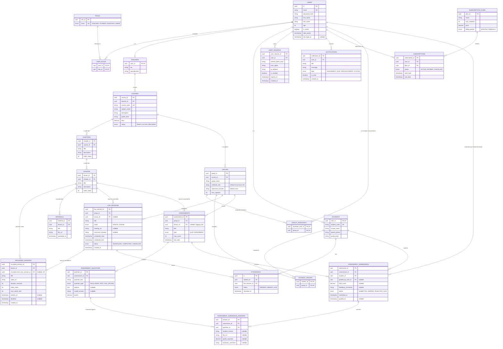

# E-Learn — Entity Relationship Diagram

The schema separates two branches that used to be tangled in a single `SESSIONS` table:

- **Curriculum (cohort-independent):** `COURSES → CHAPTERS → LESSONS`. A lesson owns its `MATERIALS` and its `RECORDED_SESSIONS` (on-demand video). This content is authored once and seen by every group taking the course.
- **Cohorts (group-specific):** `COURSES → GROUPS → LIVE_SESSIONS`. A live session is one scheduled class — onsite or online — with its own time and room, and it is what `ATTENDANCE` records against.

A recording may optionally point back at the live class it came from (`recorded_from_live_session_id`), but most recorded sessions are pre-recorded content with no live counterpart.

---

## Diagram



---

## Constraints

Mermaid cannot express these; they are part of the schema contract.

### Uniqueness

| Table | Constraint | Why |
|---|---|---|
| `CHAPTERS` | `UNIQUE (course_id, order_index)` | Deterministic chapter ordering within a course |
| `LESSONS` | `UNIQUE (chapter_id, order_index)` | Deterministic lesson ordering within a chapter |
| `RECORDED_SESSIONS` | `UNIQUE (lesson_id, order_index)` | Deterministic video ordering within a lesson |
| `RECORDED_SESSIONS` | `UNIQUE (recorded_from_live_session_id)` | Enforces the `||--o|` cardinality: at most one recording per live class |
| `ATTENDANCE` | `UNIQUE (student_id, live_session_id)` | One attendance record per student per class |
| `STUDENT_GROUPS`, `GROUP_ASSISTANTS`, `USER_ROLES` | composite PK | Already covered |

### CHECK constraints

- `LIVE_SESSIONS`: `mode = 'ONLINE'` ⇒ `meeting_url IS NOT NULL`; `mode = 'ONSITE'` ⇒ `classroom_location IS NOT NULL`
- `LIVE_SESSIONS`: `scheduled_end > scheduled_start`
- `RECORDED_SESSIONS`: `max_watch_limit >= 0`, where **`0` means unlimited**
- `SUBSCRIPTIONS`: `end_date > start_date`

### Cross-branch integrity

Splitting curriculum from cohorts introduces the possibility of the two branches drifting apart. These cannot be expressed as simple FKs and must be enforced in the service layer on create/update:

1. **`LIVE_SESSIONS.lesson_id`** — when set, the lesson's `chapter.course_id` must equal the `groups.course_id` of the session's group. A group can only cover lessons from its own course.
2. **`RECORDED_SESSIONS.recorded_from_live_session_id`** — when set, and when the source live session has a `lesson_id`, that lesson must match the recording's `lesson_id`.
3. **`ASSESSMENTS.lesson_id`** — when set, must belong to the group's course (same check as 1).

DB-level alternative for (1): add a denormalized `course_id` to `LIVE_SESSIONS` and use composite foreign keys against `GROUPS (group_id, course_id)` and a `LESSONS`-side view exposing `(lesson_id, course_id)`. Only worth the cost if the service layer is not the sole writer.

### Indexes

```
CHAPTERS (course_id)
LESSONS (chapter_id)
RECORDED_SESSIONS (lesson_id)
MATERIALS (lesson_id)
LIVE_SESSIONS (group_id, scheduled_start)   -- the timetable query
LIVE_SESSIONS (lesson_id)                   -- "which groups covered this lesson?"
ATTENDANCE (live_session_id)
ATTENDANCE (student_id)
ASSESSMENTS (group_id, due_date)
ASSESSMENT_SUBMISSIONS (assessment_id, student_id)
USER_SESSIONS (user_id, is_revoked)
NOTIFICATIONS (user_id, is_read)
```

### Delete behaviour

| Relationship | Policy | Reason |
|---|---|---|
| `COURSES → CHAPTERS → LESSONS` | `CASCADE` | The curriculum spine falls together |
| `LESSONS → MATERIALS` | `CASCADE` | Files belong to the lesson |
| `LESSONS → RECORDED_SESSIONS` | `CASCADE` | Videos belong to the lesson |
| `LESSONS → LIVE_SESSIONS.lesson_id` | `SET NULL` | **Deleting a lesson must never destroy attendance history** |
| `LIVE_SESSIONS → RECORDED_SESSIONS.recorded_from_live_session_id` | `SET NULL` | The recording outlives the schedule entry |
| `LIVE_SESSIONS → ATTENDANCE` | `CASCADE` | Attendance is meaningless without its class |
| `GROUPS → LIVE_SESSIONS` | `RESTRICT` | Archive groups; don't delete cohorts with history |
| `USERS → USER_SESSIONS` | `CASCADE` | Tokens die with the account |

---

## Notes on field semantics

- **`GROUPS.schedule_info` and `GROUPS.classroom_location` are defaults, not truth.** They describe the group's usual pattern ("Sun/Tue 4pm, Room B"). The authoritative time and place for any given class live on the `LIVE_SESSIONS` row, which is free to differ for a makeup or relocated session.
- **`LIVE_SESSIONS.lesson_id` is nullable on purpose.** Revision classes, exam prep, and open Q&A sessions are real scheduled classes that map to no single lesson.
- **`RECORDED_SESSIONS.recorded_from_live_session_id` is nullable on purpose.** Most recordings are authored pre-recorded content that never had a live counterpart. When set, it means "this video is the replay of that class".
- **`RECORDED_SESSIONS.publish_at`** gates when students may see the video; **`deadline`** is the last moment they may watch it. Both nullable — null means no gate.
- **`max_watch_limit`** is currently declarative. There is no view-tracking table in this pass, so enforcement lives in the application (or is deferred). Adding a `RECORDED_SESSION_VIEWS` log later is the natural extension.
- **`USER_SESSIONS.user_session_id`** was renamed from `session_id` to remove the name clash with the old content `SESSIONS` table. `USER_SESSIONS` is a refresh-token record and has nothing to do with classes.

## Removed

`SESSIONS` is gone. It previously carried both `video_url`/`max_watch_limit` (on-demand semantics) and was the target of `ATTENDANCE` (physical-class semantics), while hanging off `COURSES` even though attendance is inherently per-cohort. Its responsibilities are now split:

| Old `SESSIONS` field | New home |
|---|---|
| `course_id` | `LESSONS → CHAPTERS → COURSES` (derived) |
| `title` | `LESSONS.title`, plus per-occurrence `LIVE_SESSIONS.title` |
| `video_url` | `RECORDED_SESSIONS.video_url` |
| `order_index` | `LESSONS.order_index` / `RECORDED_SESSIONS.order_index` |
| `max_watch_limit` | `RECORDED_SESSIONS.max_watch_limit` |
| `deadline` | `RECORDED_SESSIONS.deadline` |
| *(referenced by `MATERIALS`)* | `MATERIALS.lesson_id` |
| *(referenced by `ATTENDANCE`)* | `ATTENDANCE.live_session_id` |
